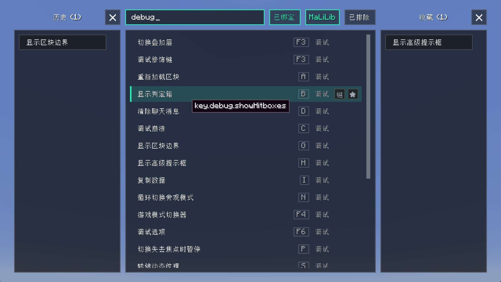

# Shortcuts Panel

English | [简体中文](README.md)

A keybind panel: search every keybinding registered by Minecraft and other mods, and
trigger it straight from the list. It can filter out already-bound keys, rebind on the
fly, keep favorites and a recent history, and exclude entries from the results.
MaLiLib-family hotkeys (Tweakeroo, MiniHUD, Litematica, ItemScroller, …) are picked up
too, with no compile-time dependency on MaLiLib.

- Opens with **K** by default (rebind it under *Options → Controls*).



## Usage

| Action | How |
| --- | --- |
| Trigger a keybind | Left-click its row |
| Rebind | Click the key button at the right end of the row, then press a key (`Esc` unbinds) |
| Favorite | Click **★** at the right end of the row |
| Exclude | Right-click a row in the results column (right-click again to restore) |
| Drop from recent | Right-click a row in the *Recent* column |
| Remove / reorder favorites | Right-click a chip, or drag it |
| Clear a column | Click **×** in its header — it turns red, click again to confirm |

Rows also respond to the keyboard: arrow keys move the selection, `Enter` triggers it,
and holding `Alt` while scrolling scrolls faster.

Three filter toggles sit next to the search box:

- **Bound** — hide keybinds that already have a key assigned (i.e. show only unbound ones);
- **MaLiLib** — include MaLiLib-family hotkeys;
- **Excluded** — show entries you excluded.

## Search

Matching covers the **display name** (weight 3), the **internal id** `key.xxx` (weight 2)
and the **category name** (weight 1). Scores rank exact > prefix > contains > subsequence,
so both localized names and raw English ids are searchable.

## Data

Favorites, recent history and the exclusion list are stored under
`config/shortcuts-panel/`.

## Install

Requires Fabric Loader and Fabric API. Drop the jar into `mods/`.
Builds are provided for Minecraft 26.1.2, 26.2 and 26.3.

## Building

```bash
./gradlew buildAll
```
